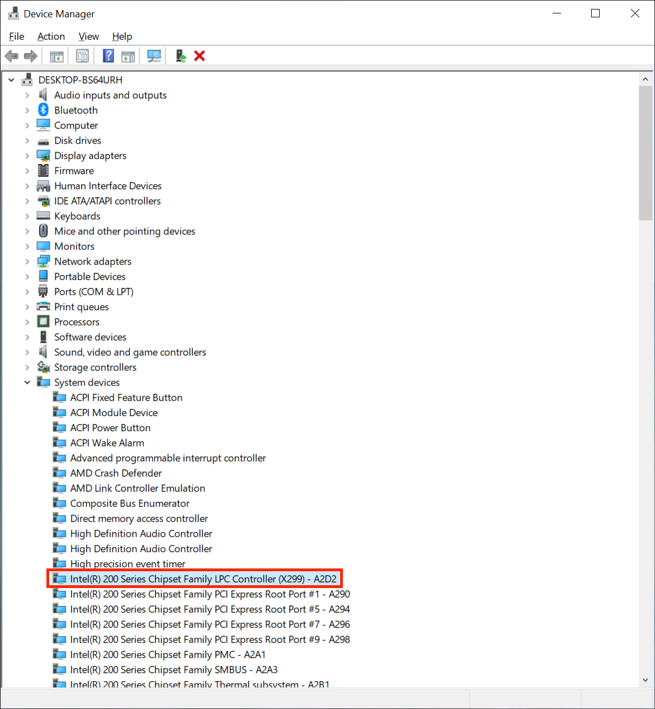
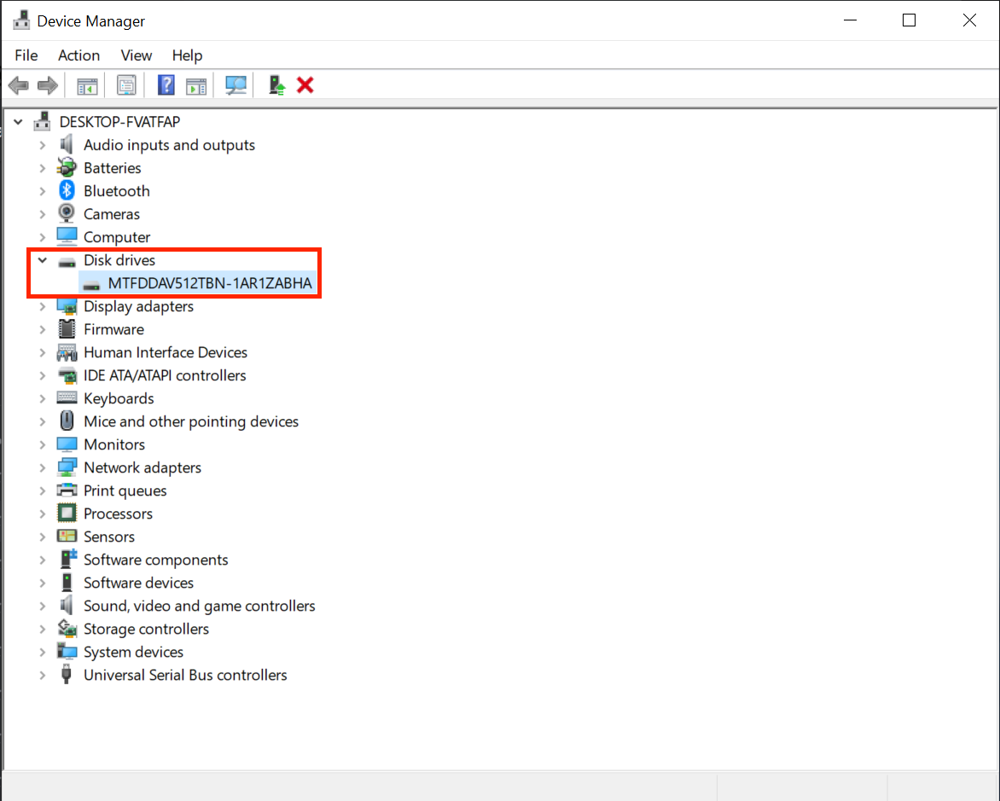

# Encontrando tu hardware

Esta sección es principalmente una mini guía de cómo encontrar qué hardware estás corriendo; lo que es principalmente relevante para laptops y computadoras pre-armadas debido a que las características de su hardware puede ser más difícil de obtener. Puedes saltearte esta página y dirigirte a [Creating the USB](./installer-guide/) si ya sabes qué hardware tienes.

Para esto, asumiremos que tienes Windows o Linux instalado.

* [Encontrando hardware usando Windows](#encontrando-hardware-usando-windows)
* [Encontrando hardware usando Linux](#encontrando-hardware-usando-linux)

## Encontrando Hardware usando Windows

Para esto tenemos principalmente 2 opciones:

* El Administrador de Dispositivos integrado de Windows
* [AIDA64](https://www.aida64.com/downloads)

Debido a la interfaz más facil de utilizar, recomendamos que descargues AIDA64 y lo corras debido a que es mucho más fácil encontrar las características de tu sistema. Sin embargo, te mostraremos los dos métodos para encontrar dichas características.

### Modelo de CPU

| AIDA64 | Administrador de Dispositivos |
| :--- | :--- |
|  |  |

### Modelo de GPU

| AIDA64 | Administrador de Dispositivos |
| :--- | :--- |
|  |  |

### Modelo de Chipset

| AIDA64 | Administrador de Dispositivos |
| :--- | :--- |
|  |  |

* Nota: Las CPUs Intel basadas en SOC tendrán el chipset y otras características en su dado/pastilla en vez de estar en chips dedicados, lo cual significa que encontrar el chipset exacto puede ser un poco más dificil.

### Tipo de conección en tu teclado, trackpad y pantalla táctil

| Administrador de dispositivos |
| :--- |
|  |

Desafortunadamente, AIDA64 no provee información útil sobre estos dispositivos, por lo que recomendamos que uses el Administrador de Dispositivos para esto.

* Puedes encontrar You can find these devices under the following:
  * `Dispositivos de interfaz de usuario (Human Interface Devices o HID en inglés)`
  * `Teclados (Keyboards en inglés)`
  * `Mouse y otros dispositivos señaladores (Mice and other Pointer Devices en inglés)`

* Para ver los tipos de conecciones exactas de el dispositivo, selecciónalo y entra a To view the exact connection type of the device, select the pointer device then enter `Ver -> Dispositivo por conección (O View -> Device by Connection en inglés)`. Esto clarificará si es PS2, I2C, SMBus, USB, etc.

#### Casos extremos

Dependiendo del dispositivo, podría mostrarse debajo de múltiples nombres y conecciones. Las principales a tener en cuenta son:

* SMBus
  * Estas aparecerán debajo de ambos PS2, como `Synaptics PS2 device` y PCI, como `Synaptic SMBus Driver`
    * Ejemplo: `Synaptics Pointer device` y `Synaptic SMBus Driver`
* USB
  * Estos aparecerán como un "PS2 Compliant Trackpad"
* Tipo de conección I2C
  * Actualmente hay varios tipos de touchpads I2C, así que encontrar tu tipo de conección exacto puede ser un poco complicado.
  
::: details Ejemplo de SMBus


Como puedes ver, vemos 2 dispositivos Synaptics en la imagen de la izquierda. Sin embargo, si miramos con atención podemos ver que el dispositivo de arriva es PS2, mientras que el de abajo es SMBus. Mientras que sí puedes usar tu trackpad en cualquiera de los dos modos, SMBus provee más funcionalidad y precisión con [VoodooRMI](https://github.com/VoodooSMBus/VoodooRMI).

* Ten en cuenta que no todos los dispositivos Synaptics soportan SMBus.

:::

::: details Ejemplo de USB

| Dispositivo por Tipo | Dispositivo por conección |
| :--- | :--- |
|  | 

Como puedes ver, nuestro trackpad se ve debajo del USB bus cuando cambiamos nuestra vista a `Dispositivos por conexión`

:::

::: details Tipo de conección I2C

Actualmente VoodooI2C soporta estos tipos de touchpads:

| Tipo de conexión | Plugin | Notas |
| :--- | :--- | :--- |
| Microsoft HID | VoodooI2CHID | - |
| Proprietarios ELAN | VoodooI2CElan | ELAN1200+ requieren de VoodooI2CHID en vez de este |
| Propietarios Synaptics | VoodooI2CSynaptics | El protocolo Synaptic F12 requiere de VoodooI2CHID |
| Touchpad FTE1001 | VoodooI2CFTE | - |
| Atmel Multitouch Protocol | VoodooI2CAtmelMXT | - |

Para determinar qué plugin usar, recomendamos la siguiente estrategia:

* Determina el driver usado por tu dispositivo I2C
* Empareja el driver con la tabla de arriba
  * Cuando sólo dice Microsoft HID Compliant, recomendamos que uses VoodooI2CHID
* Una vez que hayas instalado macOS, puedes probar y jugar con otros plugins

:::
  
### Codec de Audio

| AIDA64 | DeviceManager|
| :--- | :--- |
|  |  |

Debido a como ciertos fabricantes presentan el nombre de los dispositivos, la información más precisa que puedes tener con el administrador de dispositivos es el PCI ID (como PCI 14F1,50F4). Esto significa que tendrás que buscar en Google el ID para poder descifrar el device id. Sin embargo, AIDA64 puede presentar el nombre correcto, lo que es bastante más fácil para el usuario final.

### Modelos de controladores de Red

| AIDA64 | Administrador de dispositivos |
| :--- | :--- |
|  |  |

Debido a como ciertos fabricantes presentan el nombre de los dispositivos, la información más precisa que puedes tener con el administrador de dispositivos es el PCI ID (ej. `PCI\VEN_14E4&DEV_43A0` corresponde al vendor ID de `14E4`, y el device ID es `43A0`). Esto significa que tendrás que Googlear el ID y descifrar el device ID exacto; sin embargo, AIDA64 puede presentar el nombre exacto lo que puede facilitar las cosas.

### Modelo de disco

| AIDA64 | Device Manager|
| :--- | :--- |
|  |  |

Debido a cómo distintos fabricantes no proveen muchos detalles de los discos, tendrás que buscar en Google qué disco coincide con el nombre que te aparece.

## Encontrando hardware usando Linux

Para encontrar hardware usando Linux, utilizaremos algunas herramientas:

* `cat`
* `pciutils`
* `dmidecode`

Abajo encontrarás una lista de comandos para correr en la terminal. Por suerte la mayoría de las distros de Linux vienen con estas herramientas instaladas por defecto. Si este no es el caso, probablemente las encuentres en el administrador de paquetes de tu distribución de Linux. 

### Modelo de CPU

```sh
cat /proc/cpuinfo | grep 'model name'
```

### Modelo de GPU

```sh
lspci | grep -i --color 'vga\|3d\|2d'
```

### Modelo de Chipset

```sh
dmidecode -t baseboard
```

### Tipo de conección en tu teclado, trackpad y pantalla táctil

```sh
dmesg |grep -i 'input'
```

### Codec de audio

```sh
aplay -l
```

### Modelo de controlador de red

Información básica:

```sh
lspci | grep -i 'network'
```

Información más detallada:

```sh
lshw -class network
```

### Modelo de disco

```sh
lshw -class disk -class storage
```
