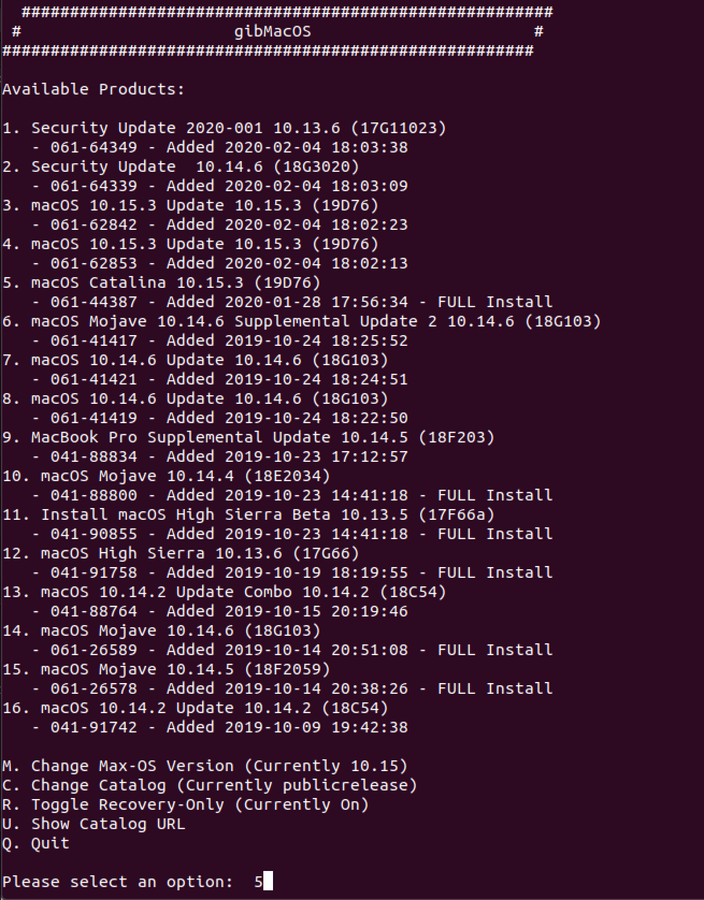
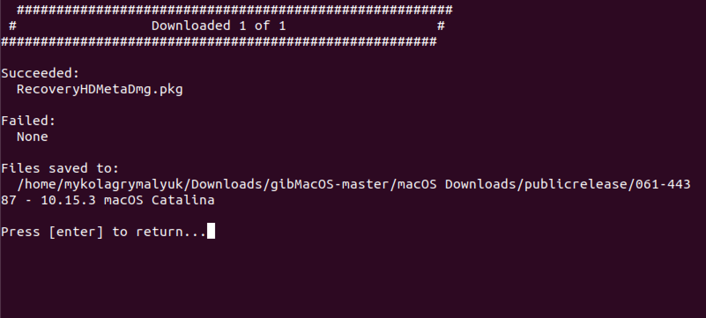
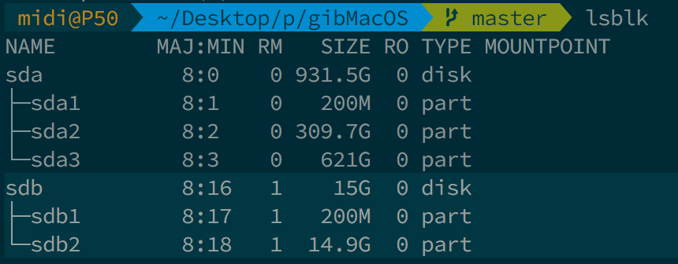
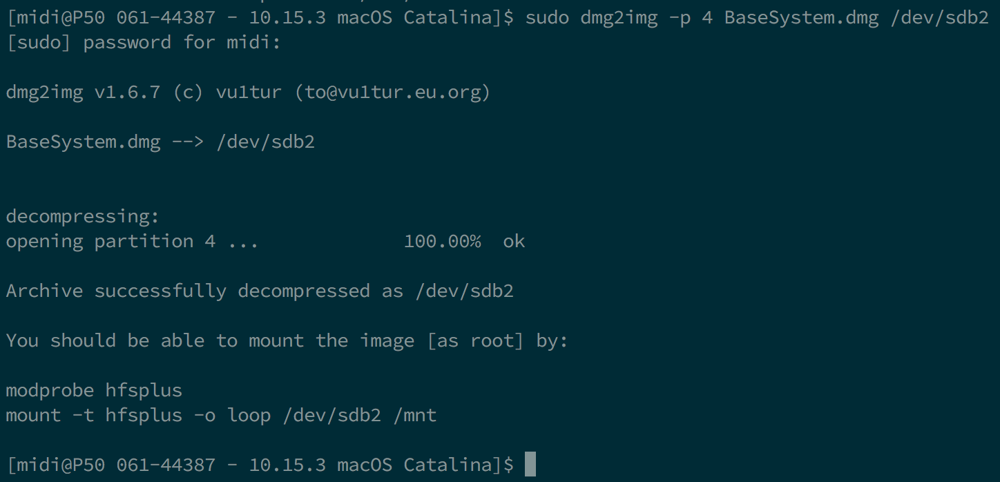

# Creando el instalador en Linux

* Versión soportada: 0.6.4

Si bien no necesitas una nueva instalación de macOS para usar OpenCore, algunos usuarios prefieren tener una nueva instalación con sus actualizaciones del gestor de arranque.

Para comenzar necesitarás lo siguiente:

* Un USB de 4GB
* [gibmacOS](https://github.com/corpnewt/gibMacOS)

## Descargando macOS

Ahora, para comenzar, corre gibmacOS.py en la terminal con `Toggle Recovery-Only`:

* `python gibMacOS.command -r`

Ahora busca a la versión de macOS que estás buscando, en este ejemplo utilizaremos la opción 5 para macOS Catalina:



Esto descargará el RecoveryHDMetaDmg.pkg a `\gibmacos-master\macOS Downloads\publicrelease\xxx-xxxxx - 10.x.x macOS xxx`



::: details Agarrando versiones legacy de macOS

Si quieres agarrar versiones más antiguas de macOS, deberías utilizar macrecovery.py, herramienta que ya está incluida en el OpenCorePkg:


Las instrucciones para correrlo son bastante simples, elige uno de los comandos de abajo dependiendo de qué versión quieres descargar:

```sh
# Lion(10.7):
./macrecovery.py -b Mac-2E6FAB96566FE58C -m 00000000000F25Y00 download
./macrecovery.py -b Mac-C3EC7CD22292981F -m 00000000000F0HM00 download
# Mountain Lion(10.8):
./macrecovery.py -b Mac-7DF2A3B5E5D671ED -m 00000000000F65100 download
# Mavericks(10.9):
./macrecovery.py -b Mac-F60DEB81FF30ACF6 -m 00000000000FNN100 download
# Yosemite(10.10):
./macrecovery.py -b Mac-E43C1C25D4880AD6 -m 00000000000GDVW00 download
# El Capitan(10.11):
./macrecovery.py -b Mac-FFE5EF870D7BA81A -m 00000000000GQRX00 download
# Sierra(10.12):
./macrecovery.py -b Mac-77F17D7DA9285301 -m 00000000000J0DX00 download
# High Sierra(10.13)
./macrecovery.py -b Mac-7BA5B2D9E42DDD94 -m 00000000000J80300 download
./macrecovery.py -b Mac-BE088AF8C5EB4FA2 -m 00000000000J80300 download
# Mojave(10.14)
./macrecovery.py -b Mac-7BA5B2DFE22DDD8C -m 00000000000KXPG00 download
# Última versión
# Ej Catalina(10.15)
./macrecovery.py -b Mac-E43C1C25D4880AD6 -m 00000000000000000 download
```

Desde aquí, corre alguno de estos comandos y cuando termine tendrás una salida similar a esta:


* **Nota**: Dependiendo del SO obtendrás archivos BaseSystem o RecoveryImage. Las dos actúan de la misma manera, por lo que cuando hacemos referencia a BaseSystem la misma información aplica a RecoveryImage

:::

## Creando el instalador

Esta sección tendrá como objetivo crear las distintas particiones en tu USB. Puedes utilizar tu programa favorito, ya sea `gdisk`` fdisk` `parted`` gparted` o `gnome-disks`. Esta guía se centrará en `gdisk` ya que es agradable y puede cambiar el tipo de partición más adelante, ya que la necesitamos para que macOS Recovery HD pueda arrancar. (La distro utilizada aquí es Ubuntu 18.04, otras versiones o distros pueden funcionar)


Créditos a [midi1996](https://github.com/midi1996) por su trabajo en la [guía de instalación por Internet](https://midi1996.github.io/hackintosh-internet-install-gitbook/), en la que esta guía está basada. 

### Método 1

1. Corre `lsblk` y determina el bloque de tu USB
  
2. Corre `sudo gdisk /dev/<el bloque de tu USB>`
   1. Si eres preguntado por qué tabla de particiones utilizar, selecciona GPT
      
   2. Manda `p` para imprimir las particiones de tu bloque \(y verifica que es la que necesitas\)
      
   3. Manda `o` para limpiar la tabla de particiones y crear una nueva GPT (si no está vacía)
      1. Confirma con `y`
         
   4. Manda `n`
      1. `número de la partición`:  mantener en blanco para usar el predeterminado 
      2. `primer sector`:  mantener en blanco para usar el predeterminado 
      3. `segundo sector`:  mantener en blanco para usar el disco entero
      4. `Código hexadecimal o GUID`: `0700` para el tipo de partición de datos básicos de Microsoft
   5. Manda `w`
      * Confirma con `y`
      
      * En algunos casos es necesario reiniciar, pero raramente. Si quieres estar seguro, reinicia tu computadora. También puedes intentar volver a enchufar tu USB.
   6. Cierra `gdisk` mandando `q` (normalmente debería cerrarse solo)
3. Usa `lsblk` para determinar los identificadores de tu partición.
4. Corre `sudo mkfs.vfat -F 32 -n "OPENCORE" /dev/<el bloque de partición de tu USB>` para formatear tu USB a FAT32 y llamarlo OPENCORE
5. Luego usa `cd` a `gibmacos-master/macOS\ Downloads/publicrelease/xxx-xxxxx - 10.x.x macOS xxx` y deberías llegar a un archivo `pkg` (o en la carpeta de Macrecovery). 
   
   1. descarga `p7zip-full` (dependiendo en las herramientas de tu distro, los usuarios de macrecovery pueden saltearse esto)
      * para Ubuntu/Basadas en Ubuntu corre `sudo apt install p7zip-full`
      * para arch arch/basadas en arch corre `sudo pacman -S p7zip`
      * para el resto, deberías saber como hacerlo
      * para todas las distros: **asegúrate que estas usando bash para que 7zip funcione**.
   2. Corre `7z e -txar *.pkg *.dmg; 7z e *.dmg */Base*` para extraer `BaseSystem.dmg` y `BaseSystem.chunklist`. Esto extraerá la recuperación del pkg mediante la extracción de el paquete de actualización de recuperación, luego el dmg de recuperación y luego la imagen HFS de él (BaseSystem.dmg). Los usuarios de Macrecovery pueden saltearse esto
   3. Monta tu partición USB con `udisksctl` (`udisksctl mount -b /dev/<el bloque de partición de tu USB>`, (sudo no es requerido en la mayoría de los casos) o con `mount` (`sudo mount /dev/<el bloque de partición de tu USB> /donde/montas/tus/cosas`, sudo es necesario)
   4. `cd` a tu USB y `mkdir com.apple.recovery.boot` en el root de la partición FAT32 de tu USB
   5. ahora `cp` o `rsync` ambos `BaseSystem.dmg` y `BaseSystem.chunklist` a la carpeta`com.apple.recovery.boot`.

### Método 2 (en caso de que el método 1 no funcionó)

En la terminal:

1. corre `lsblk` y determina el bloque de tu dispositivo USB
   
2. run `sudo gdisk /dev/<el bloque de tu USB>`
   1. if you're asked what partition table to use, select GPT.
      
   2. Manda `p` para imprimir los bloques de las particiones \(y verifica que es la que necesitas\)
      
   3. Manda `o` para borrar la tabla de particiones y crear una nueva GPT (si no está vacía)
      1. Confirma con `y`
         
   4. manda `n`
      1. partition number: mantener en blanco para usar el predeterminado 
      2. first sector: mantener en blanco para usar el predeterminado
      3. last sector: `+200M` para crear una partición de 200MB que luego llamarás OPENCORE
      4. Hex code or GUID: `0700` para el tipo de partición de datos básicos de Microsoft
      
   5. send `n`
      1. partition number: mantener en blanco para usar el predeterminado 
      2. first sector: mantener en blanco para usar el predeterminado 
      3. last sector: mantener en blanco por defecto \(o puedes hacerlo `+3G` si deseas particionar aún más el resto del USB\)
      4. Hex code or GUID: `af00` para el tipo de particiones de Apple (HFS/HFS+)
      
   6. manda `w`
      * Confirma con `y`
      
      * En algunos casos es necesario reiniciar, pero raramente. Si quieres estar seguro, reinicia tu computadora. También puedes intentar volver a enchufar tu USB.
   7. Cierra `gdisk` mandando `q` (normalmente debería cerrarse solo)
3. Usa `lsblk` de nuevo para determinar el disco de 200MB y la otra partición
   
4. corre `sudo mkfs.vfat -F 32 -n "OPENCORE" /dev/<tu bloque de particiones de 200MB>` para formatear la partición de 200MB a FAT32 y ponerle el nombre "OPENCORE"
5. luego usa `cd` a `gibmacos-master/macOS\ Downloads/publicrelease/xxx-xxxxx - 10.x.x macOS xxx` y deberías obtener un archivo `pkg`
   
   1. descarga `p7zip-full` (dependiendo en las herramientas de tu distro; los usuarios de macrecovery.py pueden saltearse esto)
      * para Ubuntu/Basadas en Ubuntu corre `sudo apt install p7zip-full`
      * para arch arch/basadas en arch corre `sudo pacman -S p7zip`
      * para el resto, deberías saber como hacerlo
      * para todas las distros: **asegúrate que estas usando bash para que 7zip funcione**.
   2. corre esto `7z e -txar *.pkg *.dmg; 7z e *.dmg */Base*` para extraer `BaseSystem.dmg` y `BaseSystem.chunklist` (usuarios de macrecovery.py pueden saltearse esto)
   3. descarga `dmg2img` (disponible en la mayoria de las distros)
   4. corre `dmg2img -l BaseSystem.dmg` y determina qué partición tiene la propiedad `disk image`
      
   5. corre `dmg2img -p <el número de la partición> -i BaseSystem.dmg -o <tu bloque de partición 3GB+>` para extraer y escribir la imagen de recuperación a la partición
      * Esto llevará un tiempo. Y aún más si estás usando un USB lento.
      

## Ahora con todo esto hecho, dirígete a [Configurando tu EFI](./opencore-efi.md) para terminar tu trabajo
