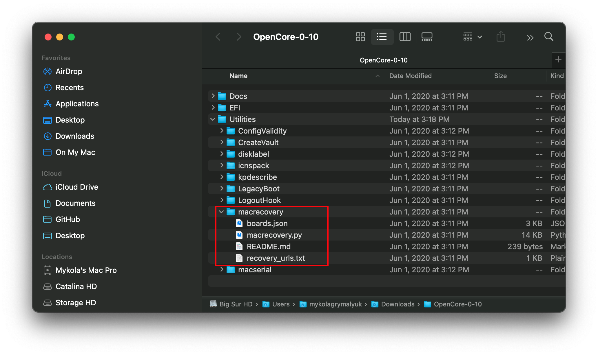

# macOS Legacy: Método online

Este método nos permite descargar versiones legacy de macOS incluyendo 10.7 hasta la actual, aunque estos son sólo instaladores de recuperación, por lo que requeriremos de una conección a internet dentro del instalador en sí

Para comenzar, querrás usar macrecovery.py, herramienta que ya viene incluida en el [OpenCorePkg](https://github.com/acidanthera/OpenCorePkg/releases):



Las instrucciones para correrlo son bastante simples, elige uno de los comandos de abajo dependiendo de qué SO quieres descargar:

```sh
# Lion(10.7):
python ./macrecovery.py -b Mac-2E6FAB96566FE58C -m 00000000000F25Y00 download
python ./macrecovery.py -b Mac-C3EC7CD22292981F -m 00000000000F0HM00 download

# Mountain Lion(10.8):
python ./macrecovery.py -b Mac-7DF2A3B5E5D671ED -m 00000000000F65100 download

# Mavericks(10.9):
python ./macrecovery.py -b Mac-F60DEB81FF30ACF6 -m 00000000000FNN100 download

# Yosemite(10.10):
python ./macrecovery.py -b Mac-E43C1C25D4880AD6 -m 00000000000GDVW00 download

# El Capitan(10.11):
python ./macrecovery.py -b Mac-FFE5EF870D7BA81A -m 00000000000GQRX00 download

# Sierra(10.12):
python ./macrecovery.py -b Mac-77F17D7DA9285301 -m 00000000000J0DX00 download

# High Sierra(10.13)
python ./macrecovery.py -b Mac-7BA5B2D9E42DDD94 -m 00000000000J80300 download
python ./macrecovery.py -b Mac-BE088AF8C5EB4FA2 -m 00000000000J80300 download

# Mojave(10.14)
python ./macrecovery.py -b Mac-7BA5B2DFE22DDD8C -m 00000000000KXPG00 download

# Catalina(10.15)
python ./macrecovery.py -b Mac-00BE6ED71E35EB86 -m 00000000000000000 download

# Última versión
# Es decir Big Sur(11)
python ./macrecovery.py -b Mac-E43C1C25D4880AD6 -m 00000000000000000 download
```


Desde aquí, corre uno de estos comandos en la terminal y una vez que terminen recibirás una salida similar a esta:


Una vez que esto esté hecho, formatea tu USB como FAT32 con un esquema de particiones GUID:


Y finalmente, crea una carpeta en la raíz de este disco llamada `com.apple.recovery.boot` y coloca los archivos BaseSystem/RecoveryImage que recién descargaste:


Desde aquí, puedes saltearte el resto e ir a [Configurando el entorno de OpenCore](./mac-install.md#setting-up-opencore-s-efi-environment)