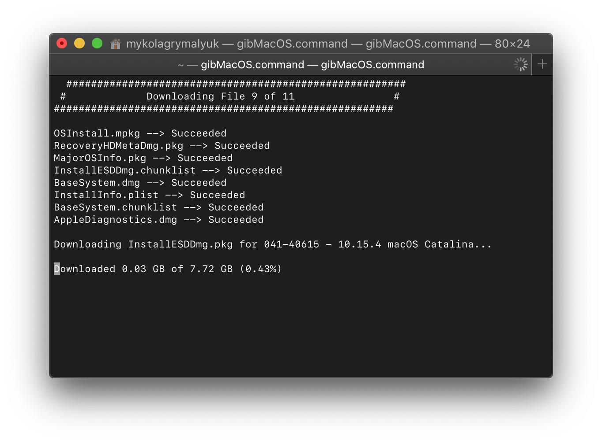
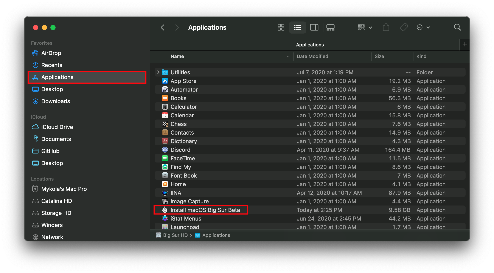
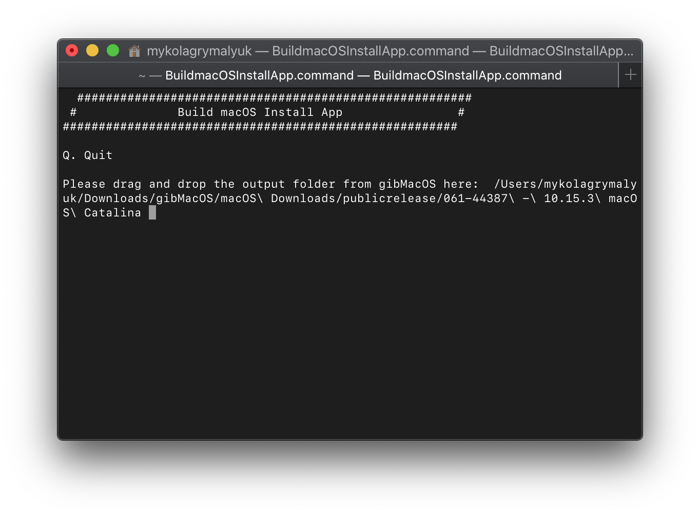
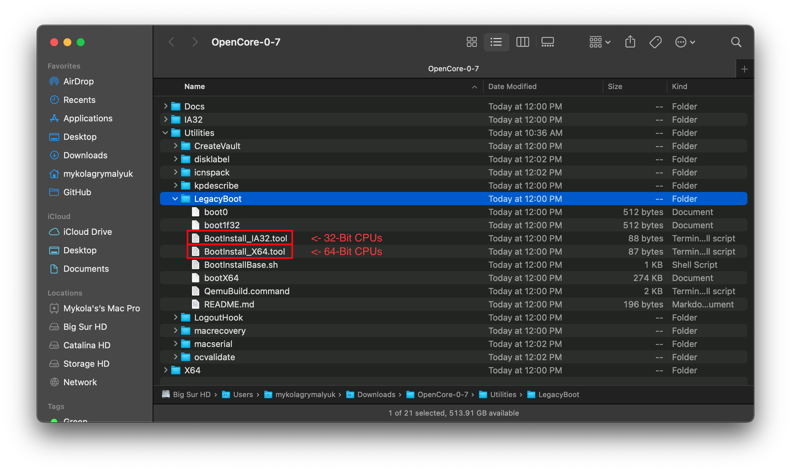

# Creando el instalador en macOS

* Versión soportada 0.6.4

Si bien no necesitas una nueva instalación de macOS para usar OpenCore, algunos usuarios prefieren tener una nueva instalación con sus actualizaciones del gestor de arranque.

Para comenzar, queremos obtener una copia de macOS, puedes omitir esto y dirigirte a formatear el USB si solo estás haciendo un dispositivo de arranque con OpenCore y no un instalador. Para los demás, pueden descargar macOS de la App Store o con gibMacOS

## Descargando macOS moderno

* Este método te permite descargar macOS 10.13 y posterior, para 10.12 y anterior dirígete a [Descargando macOS: SO Legacy](#descargando-macos-so-legacy)

Desde una computadora con macOS que cumple los requerimientos de la versión del SO que quieres instalar, vé directamente a el AppStore y descarga la versión de macOS que desees, y continúa en [**Configurando el instalador**](#configurando-el-instalador)

Para las computadoras que necesiten una versión específica de macOS o que no tengan acceso a el AppStore para descargar la versión deseada, pueden usar la herramienta GibMacOS

Ahora, obtén [gibmacOS](https://github.com/corpnewt/gibMacOS) y descomprímelo a un directorio local. 

Luego, corre el archivo `gibmacOS.command`:


Como puedes ver, obtenemos una lista de instaladores de macOS. Si necesitas versiones beta de este SO, puedes seleccionar `C. Change Catalog`. En este ejemplo escogeremos la opción 1:



Esto tomará un rato ya que estamos descargando el instalador completo de macOS (8gb+), así que recomendamos que leas el resto de la guía mientras esperas. 

Una vez terminado, tendremos que extraer o construir el instalador:

* [Extraer el insalador](#extrayendo-el-instalador)
  * Para macOS 11+
* [Construir el instalador](#construyendo-el-instalador)
  * Para macOS 10.15 y anterior

### Extrayendo el instalador

En macOS 11 y posterior, ahora Apple empaqueta el instalador con el paquete InstallAssistant, quien estará ubicado en `gibMacOS/macOS Downloads/`:


Corre el InstallAssistant.pkg y apunta a el disco del que estás arrancando, aquí es donde se pondrá la app para la instalación.


Una vez que termine el proceso deberías encontrarla en tu carpeta de Aplicciones.



Desde aquí dirígete a [Configurando el instalador](#configurando-el-instalador) para continuar con el proceso.

### Construyendo el instalaor

En macOS 10.15 y anterior el instalador será descargado en pedazos que deben ser ensamblados. Para eso querremos correr el `BuildmacOSInstallApp.command`:



Se te solicitarán los archivos del instalador de macOS que ya fueron descargados a una carpeta llamada `macOS Downloads` en el directorio de GibMacOS.

Desde Finder, busca la carpeta que contiene los archivos descargados y luego arrástralos a la terminal o usa "Cmd+C¨y pégalo en la terminal (cualquiera de las dos). 

Una vez que la operación haya terminado, sal de la herramienta, encontrarás el archivo de instalación en el directorio. 

Mueve esta aplicación a la carpeta de Aplicaciones, esto nos será útil para la siguiente sección:


Desde aquí dirígete a [Configurando el instalador](#configurando-el-instalador) para continuar con el proceso.

## Descargando macOS: SO Legacy

* Este método te permite descargar versiones mucho más antiguas de OS X, actualmente soportando todas las versiones Intel de macOS(10.4-Actual)

::: details Agarrando versiones legacy de macOS: Método offline (10.10-10.12 soportado) 

### macOS Legacy: Método offline

Este método nos permite descargar instaladores completos de Apple, aunque está limitado a 10.10, Yosemite, por lo que versiones más antiguas tendrán que ser obtenidas mediante el "Método online" mencionado abajo.

Para comenzar, dirígete a alguno de los siguientes links (información en inglés):

* [Cómo actualizar a OS X Yosemite](https://support.apple.com/es-es/HT210717)
* [Cómo actualizar a OS X El Capitan](https://support.apple.com/es-es/HT206886)
* [Cómo actualizar a macOS Sierra](https://support.apple.com/es-es/HT208202)

En el paso 4, verás `InstallOS.dmg` para Sierra o `InstallMacOSX.dmg` para El Capitan y versiones anteriores. Descarga la versión que quieres y deberías obtener un archivo .pkg.

Dependiendo de qué SO estés, puedes correr este script y dirigirte a [Configurando el instalador](#configurando-el-instalador). Sin embargo, si recives este error:


Esto significa que tendremos que extraer el instalador manualmente.

### Extrayendo el instaldor

Para empezar, agarra el InstallMacOSX/InstallOS.dmg y móntalo:


Luego, abre una ventana de la terminal y haz una carpeta en el escritorio. Corre los comandos uno por uno:

```sh
cd ~/Desktop
mkdir MacInstall && cd MacInstall
```

Ahora llegamos a la parte divertida, extrayendo el instalador (ten en cuenta que esto puede tomar algunos minutos):

* Para El Capitan (10.11) y anterior:

```sh
xar -xf /Volumes/Install\ OS\ X/InstallMacOSX.pkg
```

* Para Sierra (10.12):

```sh
xar -xf /Volumes/Install\ macOS/InstallOS.pkg
```

Luego, corre lo siguiente (uno por uno):

* Yosemite:

```sh
cd InstallMacOSX.pkg
tar xvzf Payload
mv InstallESD.dmg Install\ OS\ X\ Yosemite.app/Contents/SharedSupport/
mv Install\ OS\ X\ Yosemite.app /Applications
```

* El Capitan:

```sh
cd InstallMacOSX.pkg
tar xvzf Payload
mv InstallESD.dmg Install\ OS\ X\ El\ Capitan.app/Contents/SharedSupport/
mv Install\ OS\ X\ El\ Capitan.app /Applications
```

* Sierra:

```sh
cd InstallOS.pkg
tar xvzf Payload
mv InstallESD.dmg Install\ macOS\ Sierra.app/Contents/SharedSupport/
mv Install\ macOS\ Sierra.app /Applications
```

Una vez que esto está listo, puedes dirigirte a [Configurando el instalador](#configurando-el-instalador)!

:::

::: details Agarrando versiones legacy de macOS: Método online (10.7-10.15 soportado)

### macOS Legacy: Método online

Este método nos permite descargar versiones legacy de macOS incluyendo 10.7 hasta la actual, aunque estos son sólo instaladores de recuperación, por lo que requeriremos de una conección a internet dentro del instalador en sí

Para comenzar, querrás usar macrecovery.py, herramienta que ya viene incluida en el [OpenCorePkg](https://github.com/acidanthera/OpenCorePkg/releases):


Las instrucciones para correrlo son bastante simples, elige uno de los comandos de abajo dependiendo de qué SO quieres descargar:

```sh
# Lion(10.7):
./macrecovery.py -b Mac-2E6FAB96566FE58C -m 00000000000F25Y00 download
./macrecovery.py -b Mac-C3EC7CD22292981F -m 00000000000F0HM00 download

# Mountain Lion(10.8):
./macrecovery.py -b Mac-7DF2A3B5E5D671ED -m 00000000000F65100 download

# Mavericks(10.9):
./macrecovery.py -b Mac-F60DEB81FF30ACF6 -m 00000000000FNN100 download

# Yosemite(10.10):
./macrecovery.py -b Mac-E43C1C25D4880AD6 -m 00000000000GDVW00 download

# El Capitan(10.11):
./macrecovery.py -b Mac-FFE5EF870D7BA81A -m 00000000000GQRX00 download

# Sierra(10.12):
./macrecovery.py -b Mac-77F17D7DA9285301 -m 00000000000J0DX00 download

# High Sierra(10.13)
./macrecovery.py -b Mac-7BA5B2D9E42DDD94 -m 00000000000J80300 download
./macrecovery.py -b Mac-BE088AF8C5EB4FA2 -m 00000000000J80300 download

# Mojave(10.14)
./macrecovery.py -b Mac-7BA5B2DFE22DDD8C -m 00000000000KXPG00 download

# Catalina(10.15)
./macrecovery.py -b Mac-27AD2F918AE68F61 -m 00000000000K7GF00 download

# Versión más reciente
# Es decir Big Sur (11)
./macrecovery.py -b Mac-E43C1C25D4880AD6 -m 00000000000000000 -os latest download

```

Desde aquí, corre uno de estos comandos en la terminal y una vez que terminen recibirás una salida similar a esta:


Una vez que esto esté hecho, formatea tu USB como FAT32 con un esquema de particiones GUID:


Y finalmente, crea una carpeta en la raíz de este disco llamada `com.apple.recovery.boot` y coloca los archivos BaseSystem/RecoveryImage que recién descargaste:


Desde aquí, puedes saltearte el resto e ir a [Configurando el entorno de OpenCore](#configurando-el-entorno-de-opencore)

:::

::: details macOS Legacy: Imágenes de discos (10.4-10.6 Soportados)

### macOS Legacy: Imágenes de discos

Los instaladores de abajo fueron extraidos de discos de restauración de Macs geniunas con su bloqueo de SMBIOS desactivado, el contenido de OS X en sí no ha sido modificado de ninguna manera.

Este método en realidad depende de las imágenes alojadas por Acidanthera o Apple, y la restauración de estas a tu disco.

#### Imágenes de Acidanthera

* [OS X 10.4.10(8R4088)](https://mega.nz/folder/D3ASzLzA#7sjYXE2X09f6aGjol_C7dg)

* [OS X 10.5.7(9J3050)](https://mega.nz/folder/inRBTarD#zanf7fUbviwz3WHBU5xpCg)

* [OS X 10.6.7(10J4139)](https://mega.nz/folder/z5YUhYTb#gA_IRY5KMuYpnNCg7kR3ug/file/ioQkTagI)

#### Imágenes de Apple

Ten en cuenta que estas imágenes requieren de que tengas una cuenta de desarrollador de Apple para poder acceder.

* [OS X 10.5.0 Golden Master(9a581)](https://download.developer.apple.com/Mac_OS_X/mac_os_x_v10.5_leopard_9a581/leopard_9a581_userdvd.dmg)

* [OS X 10.6.0 Golden Master(10a432)](https://download.developer.apple.com/Mac_OS_X/mac_os_x_version_10.6_snow_leopard_build_10a432/mac_os_x_v10.6_build_10a432_user_dvd.dmg)

### Restoring the drive

Ahora viene la parte divertida, primero querrás abrir el DMG que descargaste y montarlo. Luego abre Disk Utility y formatea tu disco como macOS Extended (HFS+) con un mapa de particiones GUID:


Luego tenemos dos opciones a seguir:

* [Una restauración ASR](#asr)(**A**pple **S**oftware **R**estore)
  * Basada en la terminal, funciona mejor con el SIP habilitado
* [Disk Utility Restore](#disk-utility)
  * Puede requerir del SIP deshabilitado en SOs más recientes

#### ASR

Aquí simplemente debes abrir la terminal y correr lo siguiente:

```sh
sudo asr restore -source /Volumes/Mac\ OS\ X\ Install\ DVD  -target /Volumes/MyVolume -erase -noverify
```

* **Nota**: Esto puede no alinearse con tu configuración, por favor cámbialo en consecuencia:
  * Cambia `/Volumes/Mac\ OS\ X\ Install\ DVD` al nombre de tu imagen de disco montada
  * Cambia `/Volumes/MyVolume` al nombre de tu USB

Esto tomará un tiempo pero una vez que termine, puedes dirigirte a [Configurando el entorno de OpenCore](#configurando-el-entorno-de-opencore)

#### Disk Utility

Debido a algunos problemas molestos con Disk Utility, muchas restauraciones pueden fallar si el SIP está habilitado. Si tienes problemas recomendamos que uses el [Método ASR](#asr) o deshabilites el SIP.

Para comenzar, abre Disk Utility y deberías ver tu USB y la imagen de disco en la barra lateral. Desde aquí, selecciona restaurar/restore. 


Esto tomará un tiempo pero una vez que termine, puedes dirigirte a [Configurando el entorno de OpenCore](#configurando-el-entorno-de-opencore)

::: details Solución de problemas

Si tienes errores como este durante la restauración:


Esto seguramente signifique que el SIP debe ser deshabilitado, por lo que recomendamos que en vez sigas el [Método ASR](#asr) 

:::

## Configurando el instalador

Ahora formatearemos el USB para prepararlo para el instalador de macOS y OpenCore. Querremos utilizar el formato macOS Extended (HFS+) con el mapa de particiones GUID. Esto creará dos particiones, la principal, `MyVolume` y una segunda llamada `EFI`, la cual es la partición de arranque donde el firmware buscará archivos de arranque. 

* Nota: Ten en cuenta que la Utilidad de Discos muestra solamente las particiones por defecto, presiona Cmd/Win+2 para mostrar todos los dispositivos (o alternativamente presiona el botón de vista)
* Nota 2: Los usuarios que estén siguiendo la sección "macOS Legacy: Método online" pueden saltearse esto y dirigirse a [Configurando el entorno de OpenCore](#configurando-el-entorno-de-opencore)


Luego de esto, corre el comando `createinstallmedia`, proveído por [Apple](https://support.apple.com/en-us/HT201372), Ten en cuenta que el comando está hecho para USBs formateados con el nombre `MyVolume`:

```
sudo /Applications/Install\ macOS\ Catalina.app/Contents/Resources/createinstallmedia --volume /Volumes/MyVolume
```

Esto tomará un tiempo así que si quieres ve a buscar un café o continúa leyendo la guía (en realidad no deberías estar siguiendo la guía paso a paso sin haberla leído antes)

También puedes reemplazar la ruta de el comando `createinstallmedia` con la ruta de donde está localizado el instalador que descargaste previamente, lo mismo con el nombre del disco. 

::: details Comandos createinstallmedia legacy

Extraído de la propia página de Apple: [Cómo crear un instalador de arranque para macOS](https://support.apple.com/es-es/HT201372)

```sh
# Mojave
sudo /Applications/Install\ macOS\ Mojave.app/Contents/Resources/createinstallmedia --volume /Volumes/MyVolume
# High Sierra
sudo /Applications/Install\ macOS\ High\ Sierra.app/Contents/Resources/createinstallmedia --volume /Volumes/MyVolume
# Sierra
sudo /Applications/Install\ macOS\ Sierra.app/Contents/Resources/createinstallmedia --volume /Volumes/MyVolume
# El Capitan
sudo /Applications/Install\ OS\ X\ El\ Capitan.app/Contents/Resources/createinstallmedia --volume /Volumes/MyVolume --applicationpath /Applications/Install\ OS\ X\ El\ Capitan.app
# Yosemite
sudo /Applications/Install\ OS\ X\ Yosemite.app/Contents/Resources/createinstallmedia --volume /Volumes/MyVolume --applicationpath /Applications/Install\ OS\ X\ Yosemite.app
# Mavericks
sudo /Applications/Install\ OS\ X\ Mavericks.app/Contents/Resources/createinstallmedia --volume /Volumes/MyVolume --applicationpath /Applications/Install\ OS\ X\ Mavericks.app --nointeraction
```

:::

## Configuración Legacy

Si tienes un sistema que no soporte arranque UEFI, mira abajo:

::: details Configurando el arranque legacy

Para comenzar, necesitas lo siguiente

* BootInstall_IA32.tool o BootInstall_X64.tool
  * Estos pueden ser encontrados en el [OpenCorePkg](https://github.com/acidanthera/OpenCorePkg/releases) debajo de  `/Utilties/LegacyBoot/`
* Tu instalador USB (creado arriba)

Dentro de la carpeta de OpenCore, dirígete a `Utilities/LegacyBoot`. Aquí encontrarás un archivo llamado `BootInstall.command`. Lo que hace esto es instalar DuetPkg al disco que eligas.



Ahora corre esta herramienta en terminal **con sudo** (sin esto la herramienta probablemente fallará):

```sh
# Reemplaza X64 por IA32 si tienes una CPU de 32 bits
sudo ~/Downloads/OpenCore/Utilities/legacyBoot/BootInstall_X64.tool
```


Esto te dará una lista de discos disponibles, elige el tuyo y se te pedirá que escribas un nuevo MBR. Elige yes`[y]` y habrás terminado!


Esto te dará una partición EFI con un archivo **bootia32** o **bootx64**

:::

## Configurando el entorno de OpenCore

Configurar el entorno de OpenCore es simple, todo lo que necesitas hacer es montar la partición EFI de tu USB. Esto es hecho automáticamente cuando formateamos un disco con GUID, pero esta partición esta desmontada por defecto, aquí es cuando nuestro amigo [MountEFI](https://github.com/corpnewt/MountEFI) entra a jugar:


Te darás cuenta que cuando abrimos la partición EFI, esta está vacía. Aquí comienza lo divertido. 


# Ahora, con todo esto hecho dirígete a [Configurando la EFI](./opencore-efi.md) para terminar tu trabajo.
