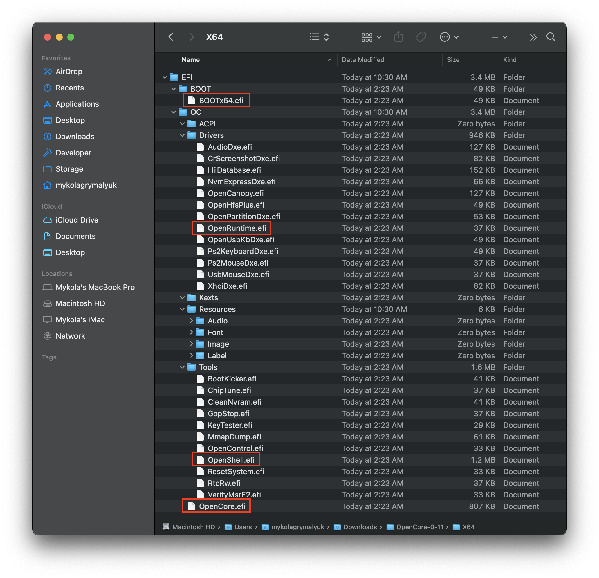
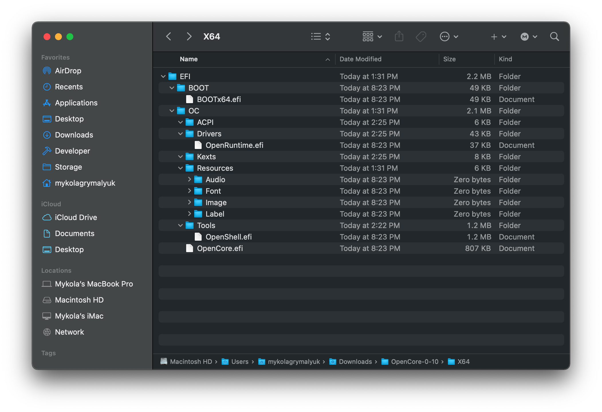

# Agregando los archivos base de OpenCore

* Versión soportada: 0.6.4

Para configurar la estructura de carpetas de OpenCore, debes tomar la carpeta EFI que se encuentra en los [lanzamientos de OpenCore](https://github.com/acidanthera/OpenCorePkg/releases/). Ten en cuenta que estarán en las carpetas IA32 o X64, la primera para Firmwares de 32 bits y la última para Firmwares de 64 bits:

Con respecto a las versiones DEBUG versus RELEASE:

* **DEBUG**: Puede ayudar con la depuración de problemas de arranque, aunque puede agregar un retraso notable a los tiempos de arranque (como 3-5 segundos para llegar al selector). Una vez que termines tu instalación, puedes pasar fácilmente a RELEASE.
* **RELEASE**: Tiempos de arranque mucho más rápidos, aunque prácticamente no se proporciona información útil de depuración en OpenCore, lo que hace que la resolución de problemas sea mucho más difícil

Una vez que lo descargues, coloca la carpeta EFI en la raíz de tu partición EFI:

**Nota:**

* **Usuarios de Windows:** Querrás colocar la carpeta EFI en la raíz de el USB que has creado anteirormente
* **Usuarios de Linux:** Esta es la partición `OPENCORE` que creamos antes

Ahora abramos nuestra carpeta EFI y veamos qué hay dentro:

Algo que te darás cuenta es que esta carpeta viene con varios archivos en las subcarpetas `Drivers` y `Tools`, no queremos la mayoría de estos.

* **Eliminar de drivers:**
  * AudioDxe.efi
    * No relacionado con el soporte de audio en macOS
  * CrScreenshotDxe.efi
    * Se usa para tomar capturas de pantalla en UEFI, no es necesario para nosotros
  * OpenUsbKbDxe.efi
    * Se utiliza para el menú de selección de OpenCore en **sistemas Legacy que ejecutan DuetPkg**, [no recomendado e incluso dañino en Ivy Bridge y posterior](https://applelife.ru/threads/opencore-obsuzhdenie-i-ustanovka.2944066/page-176#post-856653)
  * UsbMouseDxe.efi
    * idea similar a OpenUsbKbDxe, solo debería ser necesaria en sistemas Legacy que usan DuetPkg
  * NvmExpressDxe.efi
    * Se utiliza para Haswell y versiones anteriores cuando no hay un controlador NVMe integrado en el firmware
  * XhciDxe.efi
    * Se usa para Sandy Bridge y versiones anteriores cuando no hay un controlador XHCI integrado en el firmware
      * Sólo es necesario si estás usando una tarjeta de expansión de USB 3.0 en una computadora vieja
  * HiiDatabase.efi
    * Se usa para arreglar el soporte de GUI como OpenShell.efi en Sandy Bridge y versiones anteriores
      * No es necesario para arrancar
  * OpenCanopy.efi
    * Testa es la GUI opcional de OpenCore, veremos cómo configurar esto en [Post Instalación](https://dortania.github.io/OpenCore-Post-Install/cosmetic/gui.html), así que elimina esto por ahora
  * Ps2KeyboardDxe.efi + Ps2MouseDxe.efi
    * Es bastante obvio en qué casos los lo necesitas, los usuarios de teclado y mouse USB no lo necesitan
    * Recordatorio: PS2 ≠ USB

* **Borra todo de la carpeta "tools"**
  * Son demasiados para enumerarlos a todos, pero recomiendo mantener OpenShell.efi para solucionar eventuales problemas.

Una EFI limpia:

Ahora puedes colocar **tus** drivers de firmware necesarios (.efi) en la carpeta _Drivers_ y Kexts / ACPI en sus respectivas carpetas. Dirígete a [Recolectando Archivos](../ktext.md) para ver qué archivos debes incluir. 

* Ten en cuenta que los drivers UEFI de Clover no son compatibles con OpenCore (EmuVariableUEFI, AptioMemoryFix, OsxAptioFixDrv, etc). Consulta la [Página de conversión de drivers del firmware de Clover](https://github.com/dortania/OpenCore-Install-Guide/blob/master/clover-conversion/clover-efi.md) para obtener más información sobre los drivers compatibles y aquellos fusionados en OpenCore.

Así es como ***puede*** verse un EFI poblado (el tuyo probablemente será diferente):

**Recordatorio**:

* Los SSDTs y DSDTs personalizados (`.aml`) van en la carpeta ACPI
* Los Kexts(`.kext`) van en la carpeta Kexts
* Los drivers del Firmware (`.efi`) van el la carpeta Drivers

# Ahora, con todo esto hecho

... dirígete a [Recolectando archivos](/ktext.md) a obtener los kexts y drivers del firmware que necesitas.
