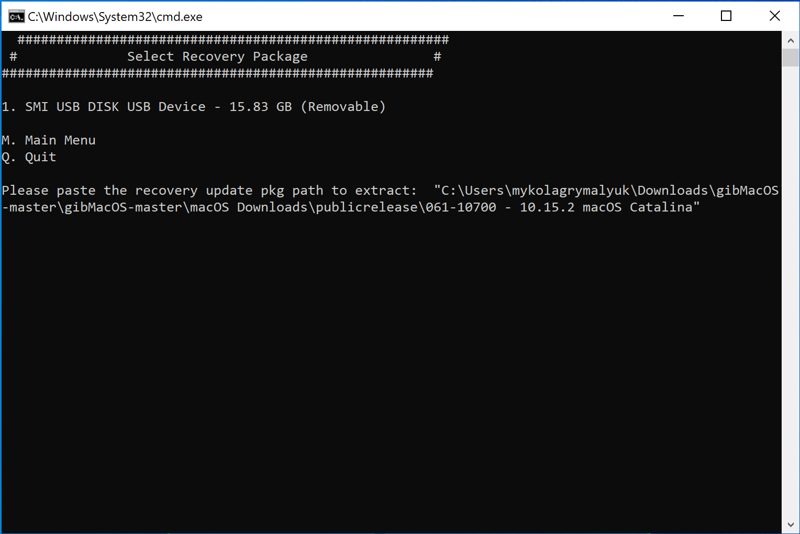
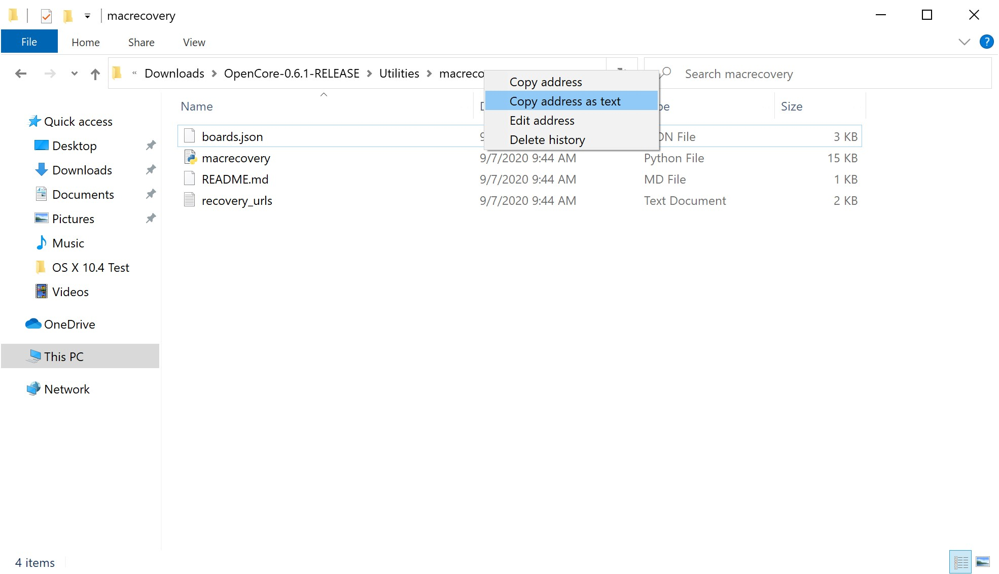

# Creando el instalador en Windows 

* Versión soportada: 0.6.2

Si bien no necesitas una nueva instalación de macOS para usar OpenCore, algunos usuarios prefieren tener una nueva instalación con sus actualizaciones del gestor de arranque.

Para comenzar necesitarás lo siguiente:

* Un USB de 4GB (o más)
* [gibmacOS](https://github.com/corpnewt/gibMacOS)

## Descargando macOS: Moderno

* Este método te permite descargar macOS 10.13 y posterior, para 10.12 y anterior dirígete a [Descargando macOS: SO Legacy](#descargamdp-macos-so-legacy)

Para comenzar, abre gibMacOS.bat como administrador y selecciona `Toggle Recovery-Only`:


Ahora busca la versión de macOS que necesitas, en este ejemplo seleccionaremos la opción 5 para macOS Catalina:


Esto descargará el RecoveryHDMetaDmg.pkg a `\gibmacos-master\macOS Downloads\publicrelease\xxx-xxxxx - 10.x.x macOS xxx`


## Creando el instalador: UEFI

* Nota: Esto está pensado para sistemas que soportan UEFI. Si tu sistema es de 2011 o anterior es poco probable que soporte UEFI.
  * Por favor verifica esto con AIDA64 o con la página de soporte de tu fabricante.

Ahora, abre el archivo `MakeInstall.bat` como administrador y selecciona tu USB con su número y la opción O para OpenCore (en el ejemplo, seleccionamos 1O)


Una vez que el disco esté formateado, te preguntará por el `RecoveryHDMetaDMG.pkg` que descargamos anteriormente. La esquina superior izquierda de la ventana del archivo le permitirá copiar la ruta del archivo:




MakeInstall terminará instalando OpenCore a la partición EFI de tu USB, podrás encontrar esta partición con el nombre `BOOT`:


## Creando el instalador: Legacy

* Nota: Esto está pensado para sistemas que no soportan UEFI. Si tu sistema es de 2011 o probable que soporte UEFI.
  * Por favor verifica esto con AIDA64 o con la página de soporte de tu fabricante.

::: details Configuración legacy

Para comenzar, necesitarás lo siguiente:

* [7-Zip](https://www.7-zip.org)
* [BOOTICE](https://www.majorgeeks.com/files/details/bootice_64_bit.html)
* [OpenCorePkg](https://github.com/acidanthera/OpenCorePkg/releases)

Presiona Windows + R, escribe `diskpart` y córrelo.

Luego corre lo siguiente:

```sh
# Enumera los discos disponibles
list disk
# Selecciona tu disco (como disk 1)
select disk 1
# Formatea el disco
clean
# Conviértelo a GPT
# Debido a un bug raro con BOOTICE y DuetPkg, los discos MBR fallan en el arranque
convert gpt
# Crea una nueva partición
create partition primary
# Selecciona tu partición
# Correr `clean` asegura que sólo tengamos una partición, por lo que será "partition 1"
select partition 1
# Formatea tu disco como FAT32
format fs=fat32 quick
# Asígnale una letra a tu disco (como Drive E, asegúrate de que no esté en uso)
ASSIGN LETTER=E
```
Luego, abre el explorador de archivos y dirígete a el disco que recién formateaste. Luego crea una carpeta llamada `com.apple.recovery.boot` en la raíz del disco.
De nuevo, en el explorador de archivos, encuentra el .pkg descargado por gibMacOS debajo de macOS Downloads en la carpeta de gibMacOS. Abre el .pkg haciéndole click derecho y clickeando en 7-Zip -> Open Archive/Abrir archivo:


Abre el RecoveryHDMeta.dmg (o un dmg con un nombre similar) y luego abre la carpeta que lo contiene, donde deberías ver BaseSystem.dmg y BaseSystem.chunklist. Arrastra/Copia estos archivos a la carpeta com.apple.recovery.boot folder en tu USB:


Luego agarra el OpenCorePkg que descargaste antes y ábrelo:


Aquí vemos carpetas IA32(para CPUs de 32 bits) y X64(CPUs de 64 bits), por lo que debes elegir la más apropiada para tu hardware y ábrela. Luego agarra la carpeta `EFI` dentro y colócala en la raíz de tu USB junto a com.apple.recovery.boot. Una vez que termines se debería ver así:


Finalmente, abre BOOTICE y asegúrate de que seleccionaste el disco correcto.


Luego, ingresa "Process MBR", selecciona "Restore MBR" y luego selecciona el archivo **boot0** en `Utilities/LegacyBoot/` dentro del OpenCorePkg:

| Restaurar MBR | Restaurar el archivo boot0 |
| :--- | :--- |
|  |  |

Después de esto dirígete a la pantalla principal y selecciona "Process PBR" y luego "Restore PBR". Desde aquí, escoge el archivo **Boot1f32** encontrado en `Utilities/LegacyBoot/` dentro del OpenCorePkg:

| Restaurar PBR | Restaurar el archivo boot1f32 |
| :--- | :--- |
|  |  |

Una vez que esto esté hecho, dirígete a tu USB y haz una última cosa. Agarra el archivo **bootx64**(CPUs de 64 bits) o **bootia32**(CPUs de 32 bits) encontrado `Utilities/LegacyBoot/` y colócalo en la raíz de tu USB:


:::


## Descargando macOS: SO Legacy

* Este método permite que descargues versiones mucho más antiguas de OS X, actualmente soportando desde OS X 10.7 hasta la versión actual

::: details Configuración de macOS legacy

Obtener instaladores legacy es muy fácil, primero descarga una copia del [OpenCorePkg](https://github.com/acidanthera/OpenCorePkg/releases) y dirígete a `/Utilities/macrecovery/`. Luego copia la ruta de la carpeta:



Desde aquí, querrás abrir una ventana de símbolo del sistema (cmd) y utilizar `cd` para quedar dentro de la carpeta macrecovery que copiamos antes:

```sh
cd Pega_la_ruta_de_la_carpeta
```

Ahora corre uno de los siguientes comandos dependiendo de qué versión de macOS quieres (ten en cuenta que estos scripts dependen del soporte de [Python](https://www.python.org/downloads/), así que instálalo si no lo has hecho aún):

```sh
# Lion(10.7):
./macrecovery.py -b Mac-2E6FAB96566FE58C -m 00000000000F25Y00 download
./macrecovery.py -b Mac-C3EC7CD22292981F -m 00000000000F0HM00 download
# Mountain Lion(10.8):
./macrecovery.py -b Mac-7DF2A3B5E5D671ED -m 00000000000F65100 download
# Mavericks(10.9):
./macrecovery.py -b Mac-F60DEB81FF30ACF6 -m 00000000000FNN100 download
# Yosemite(10.10):
./macrecovery.py -b Mac-E43C1C25D4880AD6 -m 00000000000GDVW00 download
# El Capitan(10.11):
./macrecovery.py -b Mac-FFE5EF870D7BA81A -m 00000000000GQRX00 download
# Sierra(10.12):
./macrecovery.py -b Mac-77F17D7DA9285301 -m 00000000000J0DX00 download
# High Sierra(10.13)
./macrecovery.py -b Mac-7BA5B2D9E42DDD94 -m 00000000000J80300 download
./macrecovery.py -b Mac-BE088AF8C5EB4FA2 -m 00000000000J80300 download
# Mojave(10.14)
./macrecovery.py -b Mac-7BA5B2DFE22DDD8C -m 00000000000KXPG00 download
# Última versión
# Como Catalina(10.15)
./macrecovery.py -b Mac-E43C1C25D4880AD6 -m 00000000000000000 download
```

Esto tomará un tiempo, y cuando termine deberías obtener un archivo BaseSystem o RecoveryImage:


Ahora que tenemos nuestro instalador descargado, querremos formatear nuestro USB

Presiona Windows + R, escribe `diskpart` y córrelo.

Luego corre lo siguiente:

```sh
# Enumera los discos disponibles
list disk
# Selecciona tu disco (como disk 1)
select disk 1
# Formatea el disco
clean
# Conviértelo a GPT
# Debido a un bug raro con BOOTICE y DuetPkg, los discos MBR fallan en el arranque
convert gpt
# Crea una nueva partición
create partition primary
# Selecciona tu partición
# Correr `clean` asegura que sólo tengamos una partición, por lo que será "partition 1"
select partition 1
# Formatea tu disco como FAT32
format fs=fat32 quick
# Asígnale una letra a tu disco (como Drive E, asegúrate de que no esté en uso)
ASSIGN LETTER=E
```

Luego, ve a la raíz del USB y crea una carpeta llamada `com.apple.recovery.boot`. Después mueve los archivos BaseSystem or RecoveryImage que descargaste. Por favor asegúrate que copiaste los archivos .dmg y .chunklist a esta carpeta:


Luego agarra el OpenCorePkg que descargaste antes y ábrelo:


Aquí vemos carpetas IA32(para CPUs de 32 bits) y X64(CPUs de 64 bits), por lo que debes elegir la más apropiada para tu hardware y ábrela. Luego agarra la carpeta `EFI` dentro y colócala en la raíz de tu USB junto a `com.apple.recovery.boot`. Una vez que termines se debería ver así:


::: details Configuración de instalación legacy

Si tu firmware no soporta UEFI, mira las instrucciones de abajo:
Para comenzar, necesitarás lo siguiente:
* [7-Zip](https://www.7-zip.org)
* [BOOTICE](https://www.majorgeeks.com/files/details/bootice_64_bit.html)
* [OpenCorePkg](https://github.com/acidanthera/OpenCorePkg/releases)
Luego, abre BOOTICE y asegúrate de seleccionar el disco correcto:

Después, ingresa "Process MBR", selecciona "Restore MBR" y luego selecciona el archivo **boot0** en `Utilities/LegacyBoot/` dentro del OpenCorePkg:

| Restaurar MBR | Restaurar el archivo boot0 |
| :--- | :--- |
|  |  |

Después de esto dirígete a la pantalla principal y selecciona "Process PBR" y luego "Restore PBR". Desde aquí, escoge el archivo **Boot1f32** encontrado en `Utilities/LegacyBoot/` dentro del OpenCorePkg:

| Restaurar PBR | Restaurar el archivo boot1f32 |
| :--- | :--- |
|  |  |

Una vez que esto esté hecho, dirígete a tu USB y haz una última cosa. Agarra el archivo **bootx64**(CPUs de 64 bits) o **bootia32**(CPUs de 32 bits) encontrado `Utilities/LegacyBoot/` y colócalo en la raíz de tu USB:


:::

# Ahora con todo esto hecho dirígete a [Configurando la EFI](./opencore-efi.md) para terminar tu trabajo.
