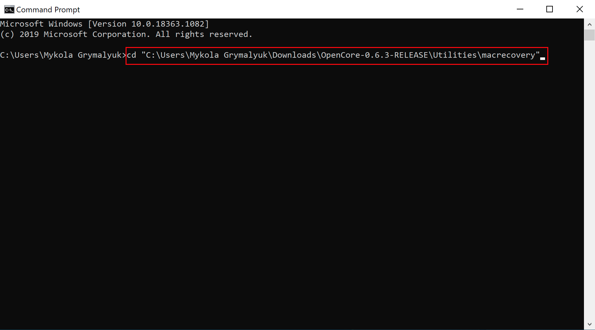
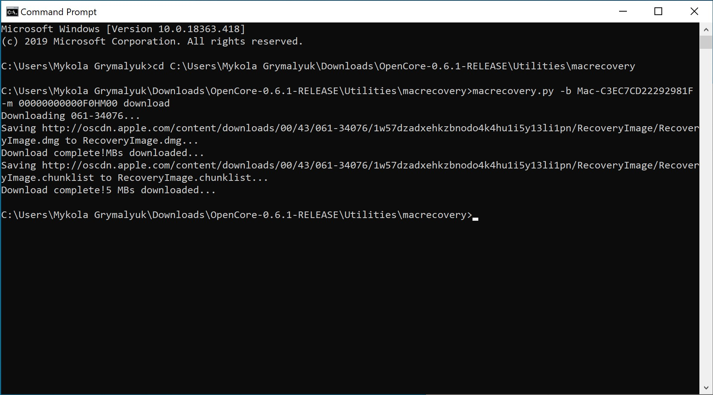
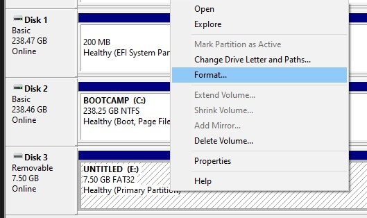
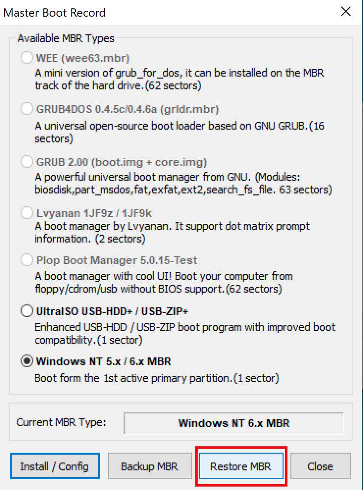
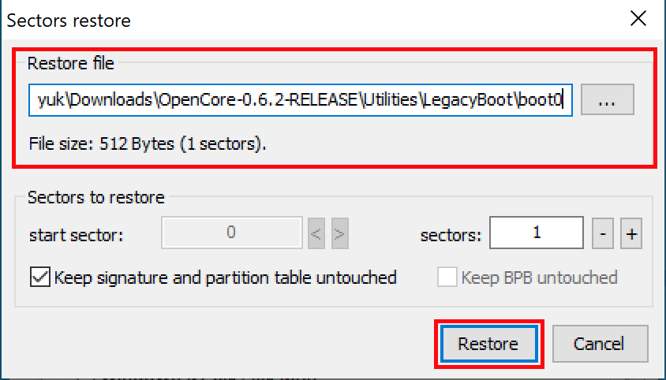
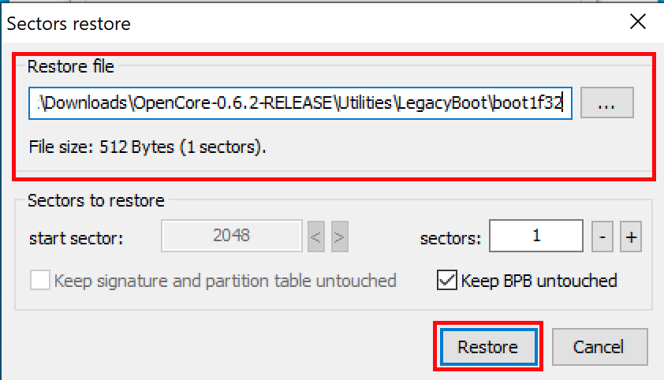

# Creando el instalador en Windows 

* Versión soportada: 0.6.4

Si bien no necesitas una nueva instalación de macOS para usar OpenCore, algunos usuarios prefieren tener una nueva instalación con sus actualizaciones del gestor de arranque.

Para comenzar necesitarás lo siguiente:

* Un USB de 4GB (o más)
* [macrecovery.py](https://github.com/acidanthera/OpenCorePkg/releases)
  * Esto requerirá que tengas [Python instalado](https://www.python.org/downloads/)
## Descargando macOS

Descargar instaladores es muy fácil, sólo descarga una copia de [OpenCorePkg](https://github.com/acidanthera/OpenCorePkg/releases) y dirígete a `/Utilities/macrecovery/`. Luego copia la ruta de la carpeta macrecovery:

* Nota: El macrecovery.py de 0.6.4 y anterior está roto, por lo que tendrás que descargar una copia del ["master" de OpenCorePkg](https://github.com/acidanthera/opencorepkg) y utilizar la versión de macrecovery ubicada en Utilities/macrecovery/.


Desde aquí querrás abrir una ventana de Símbolo del Sistema (cmd) y utilizar `cd` para llegar a la carpeta macrecovery de la que copiamos la ruta:

```sh
cd Pega_la_ruta_de_la_carpeta
```



Ahora corre uno de los siguientes comandos dependiendo de qué version de macOS quieres (ten en cuenta que los mismos dependen del soporte de [Python](https://www.python.org/downloads/), por favor instálalo si no lo has hecho aún):

```sh
# Lion(10.7):
python macrecovery.py -b Mac-2E6FAB96566FE58C -m 00000000000F25Y00 download
python macrecovery.py -b Mac-C3EC7CD22292981F -m 00000000000F0HM00 download

# Mountain Lion(10.8):
python macrecovery.py -b Mac-7DF2A3B5E5D671ED -m 00000000000F65100 download

# Mavericks(10.9):
python macrecovery.py -b Mac-F60DEB81FF30ACF6 -m 00000000000FNN100 download

# Yosemite(10.10):
python macrecovery.py -b Mac-E43C1C25D4880AD6 -m 00000000000GDVW00 download

# El Capitan(10.11):
python macrecovery.py -b Mac-FFE5EF870D7BA81A -m 00000000000GQRX00 download

# Sierra(10.12):
python macrecovery.py -b Mac-77F17D7DA9285301 -m 00000000000J0DX00 download

# High Sierra(10.13)
python macrecovery.py -b Mac-7BA5B2D9E42DDD94 -m 00000000000J80300 download
python macrecovery.py -b Mac-BE088AF8C5EB4FA2 -m 00000000000J80300 download

# Mojave(10.14)
python macrecovery.py -b Mac-7BA5B2DFE22DDD8C -m 00000000000KXPG00 download

# Catalina(10.15)
python macrecovery.py -b Mac-00BE6ED71E35EB86 -m 00000000000000000 download

# Última versión disponible
# Es decir Big Sur(11)
python macrecovery.py -b Mac-E43C1C25D4880AD6 -m 00000000000000000 download
```

* **Nota para macOS 11, Big Sur**: Debido a que este sistema operativo es bastante nuevo, siguen habiento problemas a resolver con algunos sistemas. Para más informacion, visita el siguiente link (información en inglés): [OpenCore and macOS 11: Big Sur](https://dortania.github.io/OpenCore-Install-Guide/extras/big-sur/)
  * Para usuarios novatos, recomendamos la instalación de macOS 10.15, Catalina
* **Nota para GPUs Nvidia**: Recuerda verificar si tu hardware soporta las versiones más nuevas, dirigete a [Limitaciones de hardware](../macos-limits.md)

Esto tomará un tiempo, y cuando termine deberías obtener un archivo BaseSystem o RecoveryImage:



| BaseSystem | RecoveryImage |
| :--- | :--- |
| |  |

Ahora que tenemos nuestro instalador descargado, querremos formatear nuestro USB

## Creando el instalador

Aquí formatearemos nuestro USB y le agregaremos macOS; tenemos dos opciones:

* [Método con administrador de discos](#metodo-con-administrador-de-discos)
  * Basado en una interfaz gráfica, opción más simple
  * Sólo lo soportan sistemas UEFI (2012+)
* [Método diskpart](#metodo-diskpart)
  * Basado en una línea de comandos, por lo que requiere un poco más de trabajo
  * Requerido por sistemas legacy (es decir, no UEFI, pre-2012)

### Método administración de discos

Simplemente abre la administración de discos y formatea tu USB como FAT32:

1. Haz click derecho en el botón de inicio y selecciona administración de discos.
2. Deberías ver todas tus particiones y discos. En la mitad de abajo verás tus dispositivos; encuentra tu USB.
3. Querrás formatear el USB para que tenga una partición FAT32.

* Si tienes más de una partición en el USB, haz click derecho en cada una y clickea eliminar volumen para tu USB (esto va a eliminar todo de este, asi que asegúrate de que tienes un respaldo y que solo eliminas particiones de tu USB)
  * Haz click derecho en el espacio sin asignar y crea un nuevo volumen simple. Asegúrate de que es FAT32 y tenga al menos uno o dos gigabytes de espacio. Nómbralo "EFI".
* Si este no es el caso, haz click derecho en la partición en el USB, haz click en formatear y configuralo a FAT32.



Luego, dirígete a la raíz de tu USB y crea una carpeta llamada `com.apple.recovery.boot`. Luego mueve el archivo BaseSystem/RecoveryImage a la misma. Asegúrate que copias los archivos .dmg y .chunklist a esta carpeta:


Ahora abre el OpenCorePkg que descargaste antes:


Aquí vemos carpetas IA32(para CPUs de 32 bits) y X64(CPUs de 64 bits), por lo que debes elegir la más apropiada para tu hardware y ábrela. Luego agarra la carpeta `EFI` dentro y colócala en la raíz de tu USB junto a `com.apple.recovery.boot`. Una vez que termines se debería ver así:


### Método DiskPart

::: details Método utilizando DiskPart

Presiona Windows + R, escribe `diskpart` y córrelo.

Luego corre lo siguiente:

```sh
# Enumera los discos disponibles
list disk
# Selecciona tu disco (como disk 1)
select disk 1
# Formatea el disco
clean
# Conviértelo a GPT
# Debido a un bug raro con BOOTICE y DuetPkg, los discos MBR fallan en el arranque
convert gpt
# Crea una nueva partición
create partition primary
# Selecciona tu partición
# Correr `clean` asegura que sólo tengamos una partición, por lo que será "partition 1"
select partition 1
# Formatea tu disco como FAT32
format fs=fat32 quick
# Asígnale una letra a tu disco (como Drive E, asegúrate de que no esté en uso)
ASSIGN LETTER=E
```

Luego, ve a la raíz del USB y crea una carpeta llamada `com.apple.recovery.boot`. Después mueve los archivos BaseSystem or RecoveryImage que descargaste. Por favor asegúrate que copiaste los archivos .dmg y .chunklist a esta carpeta:


Ahora abre el OpenCorePkg que descargaste antes:


Aquí vemos carpetas IA32(para CPUs de 32 bits) y X64(CPUs de 64 bits), por lo que debes elegir la más apropiada para tu hardware y ábrela. Luego agarra la carpeta `EFI` dentro y colócala en la raíz de tu USB junto a `com.apple.recovery.boot`. Una vez que termines se debería ver así:


:::

::: details Configuración Legacy

Si tu firmware no soporta UEFI, mira las instrucciones de abajo:

Para comenzar, necesitarás lo siguiente:

* [7-Zip](https://www.7-zip.org)
* [BOOTICE](https://www.majorgeeks.com/files/details/bootice_64_bit.html)
* [OpenCorePkg](https://github.com/acidanthera/OpenCorePkg/releases)

Ahora abre BOOTICE y asegúrate de que seleccionaste el disco correcto.


Luego, ingresa "Process MBR", selecciona "Restore MBR" y luego selecciona el archivo **boot0** en `Utilities/LegacyBoot/` dentro del OpenCorePkg:

| Restaurar MBR | Restaurar el archivo boot0 |
| :--- | :--- |
|  |  |

Después de esto dirígete a la pantalla principal y selecciona "Process PBR" y luego "Restore PBR". Desde aquí, escoge el archivo **Boot1f32** encontrado en `Utilities/LegacyBoot/` dentro del OpenCorePkg:

| Restaurar PBR | Restaurar el archivo boot1f32 |
| :--- | :--- |
|  |  |

Una vez que esto esté hecho, dirígete a tu USB y haz una última cosa. Agarra el archivo **bootx64**(CPUs de 64 bits) o **bootia32**(CPUs de 32 bits) encontrado `Utilities/LegacyBoot/` y colócalo en la raíz de tu USB. **Renombra este archivo a boot** para asegurarte de que DuetPkg funcione correctamente:


:::
# Ahora con todo esto hecho dirígete a [Configurando la EFI](./opencore-efi.md) para terminar tu trabajo.
