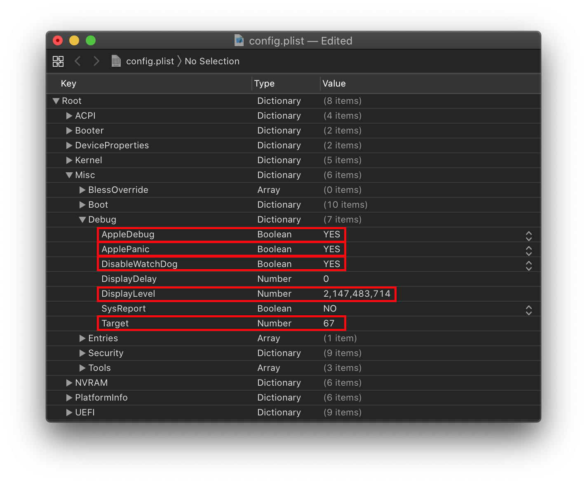

# Depuración de OpenCore

* Versión soportada: 0.6.4

Necesitas descifrar por qué estas teniendo problemas? Bueno, llegaste al lugar correcto.

Para comenzar, asegúrate de que estás usando versión de OpenCore `DEBUG` o `NOOPT`. Esto te dará mucha más información que la versión `RELEASE`, aunque hay algunos archivos en específico que deben ser reemplazados:

* EFI/BOOT/
  * `BOOTx64.efi`
* EFI/OC/Bootstrap/
  * `Bootstrap.efi`
* EFI/OC/Drivers/
  * `OpenRuntime.efi`
  * `OpenCanopy.efi`(Si lo estás usando)
* EFI/OC/
  * `OpenCore.efi`

* **Nota**: Generalmente es preferible depurar tu sistema sin OpenCanopy, si lo requieres asegúrate de que este archivo es de la versión DEBUG, ya que sino no obtendrás información de depuración.

Luego, dirígete a tu config.plist y localiza la sección `Misc`, tenemos un par de entradas que debemos ajustar:

**AppleDebug**: YES

Habilita el logging de boot.efi. Esto nos dará mucha más información de depuración, específicamente relacionada a boot.efi y también guardará los registros en el disco.

**ApplePanic**: YES

Intenta registrar kernel panics en el disco, es altamente recomendado mantener el boot arg `keepsyms=1` para conservar la mayor cantidad de información posible.

**DisableWatchDog**: YES

Deshabilita el watchdog UEFI, puede ayudar con problemas de arranque temprano como cuando OpenCore se detiene en algo no crítico

**Target**: `67` (o calcula uno abajo)

Used for enabling different levels of debugging

* `0x01` — Habilita el registro
* `0x02` — Habilita la depuración visible en la pantalla
* `0x04` — Habilita el registro al "Data Hub"
* `0x08` — Habilita el registro del puerto serial
* `0x10` — Habilita el registro de la variable UEFI
* `0x20` — Habilita el registro de variables UEFI no volátiles
* `0x40` — Habilita el registro a un archivo

Para calcular el target podemos usar una calculadora hexadecimal y convertirla a decimal. En nuestro caso queremos tener nuestros valores guardados en un archivo .txt para verlo luego:

* `0x01` — Habilita el registro
* `0x02` — Habilita la depuración visible en la pantalla
  * Ten en cuenta que esto puede hacer que los tiempos de arranque sean **mucho** más largos en firmwares con implementaciones malas de GOP
* `0x10` — Habilita el registro de la variable UEFI
* `0x40` — Habilita el registro a un archivo

`0x01` + `0x02` + `0x10` + `0x40` = `0x53`

`0x53` convertido a decimal pasa a ser `83`

Así que podemos establecer `Misc` -> `Debug` -> `Target` -> `83`

**DisplayLevel**: `2147483714` (o calcula uno abajo)

Utilizado para establecer qué es registrado

* `0x00000002` — DEBUG\_WARN en DEBUG, NOOPT, RELEASE
* `0x00000040` — DEBUG\_INFO en DEBUG, NOOPT
* `0x00400000` — DEBUG\_VERBOSE en versiones personalizadas
* `0x80000000` — DEBUG\_ERROR en DEBUG, NOOPT, RELEASE.

Una lista completa puede ser encontrada en [DebugLib.h](https://github.com/tianocore/edk2/blob/UDK2018/MdePkg/Include/ibrary/DebugLib.h).

En nuestro caso sólo queremos lo siguiente:

* `0x00000002` — DEBUG\_WARN en DEBUG, NOOPT, RELEASE.
* `0x00000040` — DEBUG\_INFO en DEBUG, NOOPT.
* `0x80000000` — DEBUG\_ERROR en DEBUG, NOOPT, RELEASE.

Al igual que con `Target`, usamos una calculadora hexadecimal y luego convertimos a decimal:

`0x80000042` Convertido a decimal `Misc` -> `Debug` -> `DisplayLevel` -> `2147483714`

Una vez terminado, tu config.plist se debería ver algo así:

## Deshabilitando el registro

Para eliminar todos los registros, establece `Target` a `0`
