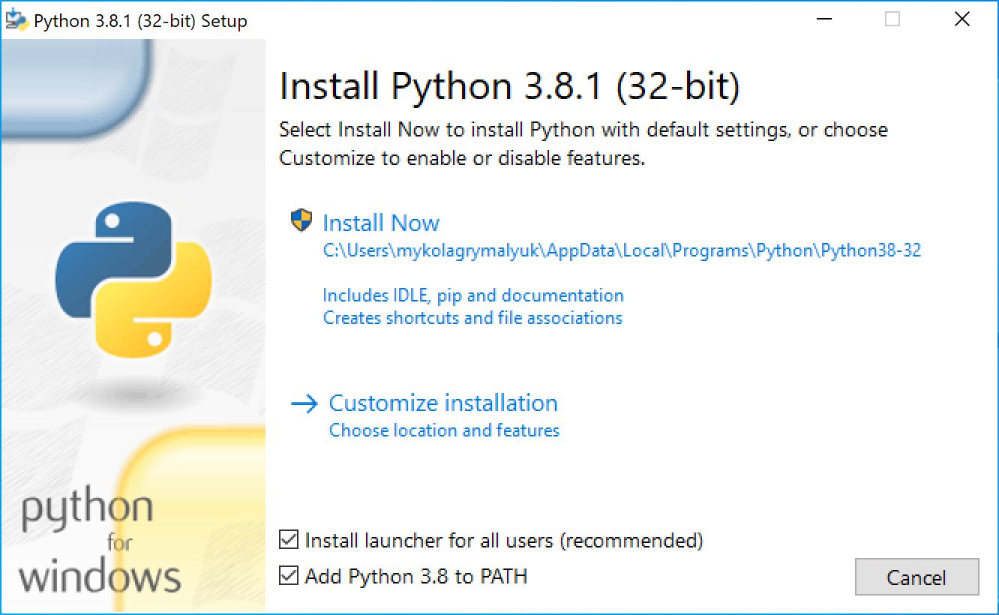
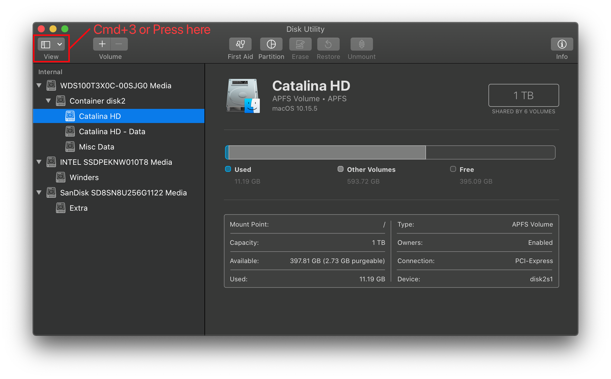

# Otros problemas misceláneos

* Versión soportada: 0.6.5

* [No puedes correr `acpidump.efi`](#no-puedes-correr-acpidumpefi)
* [Arreglando SSDTTime: `Could not locate or download iasl!`](#arreglando-ssdttime-could-not-locate-or-download-iasl)
* [Arreglar Python: `Python is not installed or not found on PATH`](#arreglar-python-python-is-not-installed-or-not-found-on-path)
* [El disco de Windows no puede ver discos APFS](#el-disco-de-windows-no-puede-ver-discos-apfs)
* [Resolución incorrecta con OpenCore](#resolución-incorrecta-con-opencore)
* [No puedo encontrar el disco de Windows/BootCamp en el menú](#no-puedo-encontrar-el-disco-de-windowsbootcamp-en-el-menú)
* [Bootear Windows resulta en una pantalla azul o Linux se crashea](#bootear-windows-resulta-en-una-pantalla-azul-o-linux-se-crashea)
* [Error al iniciar Windows: `OCB: StartImage failed - Already started`](#error-al-iniciar-windows-ocb-startimage-failed---already-started)
* [iASL warning, # unresolved](#iasl-warning--unresolved)
* [MediaKit reporta que no hay espacio suficiente](#mediakit-reports-not-enough-space)
* [Error al iniciar Windows: `OCB: StartImage failed - Already started`](#error-al-iniciar-windows-ocb-startimage-failed---already-started)
* [Inconsistencia de tiempo entre macOS y Windows](#inconsistencia-de-tiempo-entre-macos-y-windows)

## No puedes correr `acpidump.efi`

Corre en el shell de OpenCore:

```
shell> fs0: //reemplaza con el disco

fs0:\> dir //para verificar que es el directorio correcto

  Directory of fs0:\

   01/01/01 3:30p  EFI

fs0:\> cd EFI\OC\Tools //note that its with forward slashes

fs0:\EFI\OC\Tools> acpidump.efi -b -n DSDT -z
```

## Arreglando SSDTTime: `Could not locate or download iasl!`

Esto usualmente es debido a una version desactualizada de Python, trata de actualizar Python o agrega iasl a la carpeta scripts de SSDTTime:

* [iasl para macOS](https://bitbucket.org/RehabMan/acpica/downloads/iasl.zip)
* [iasl para Windows](https://acpica.org/downloads/binary-tools)
* [iasl para Linux](http://amdosx.kellynet.nl/iasl.zip)

## Arreglar Python: `Python is not installed or not found on PATH`

Fácil de arreglar, descarga e instala el Python más reciente:

* [Link para macOS](https://www.python.org/downloads/macos)
* [Link para Windows](https://www.python.org/downloads/windows/)
* [Link para Linux](https://www.python.org/downloads/source/)

Make sure `Add Python to PATH`



## El disco de Windows no puede ver discos APFS

* Drivers de BootCamp desactualizados (generalmente la versión 6.0 vendrá con brigadier, la utilidad de BootCamp en macOS provee versiones más nuevas como 6.1). CorpNewt también hizo un fork de brigadier arreglando estos errores: [Brigadier de CorpNewt](https://github.com/corpnewt/brigadier)

## Resolución incorrecta con OpenCore

* Sigue la guía de [Arreglando resolución y Verbose](https://dortania.github.io/OpenCore-Post-Install/cosmetic/verbose.html) para una configuración correcta, configura `UIScale` a `02` para HiDPI
* Algunos usuarios se dieron cuenta que configurando `ConsoleMode` a Max puede fallar a veces, dejándolo vacío puede ayudar.

## No puedo encontrar el disco de Windows/BootCamp en el menú

En el caso de OpenCore, debemos tener en cuenta que las instalaciones legacy de Windows no son soportadas, únicamente UEFI. La mayoría de las instalaciones ahora son basasdas en UEFI pero aquellas hechas con el asistente de BootCamp son basadas en lagacy, así que tendrás que encontrar otras maneras de hacer un instalador (aquí Google es tu amigo). Esto también significa que las particiones MBR/Híbridas también están rotas así que tenrdrás que formatear el disco en el que quieres instalar Windows con Disk Utility. Dirígete a la guía [Multiboot](https://hackintosh-multiboot.gitbook.io/hackintosh-multiboot/) para obtener más información.

Ahora, veremos algunas soluciones:

* Asegúrate que `Misc -> Security -> ScanPolicy` está configurado a `0` para mostrar todos los discos
* `Misc -> Boot -> Hideself` debe estar habilitado cuando el gestor de arranque de Windows está en el mismo disco

## Bootear Windows resulta en una pantalla azul o Linux se crashea

Esto se debe a problemas de alineación, asegúrate de que `SyncRuntimePermissions` esté habilitado en firmwares compatibles con MAT. Verifica tus registros si tu firmware es compatible con las tablas de atributos de memoria (MATs, los cuales generalmente se ven en los firmwares de 2018 en adelante)

Error común de Windows:

* `0xc000000d`

## Error al iniciar Windows: `OCB: StartImage failed - Already started`

Esto es debido a que OpenCore se queda confundido cuando intenta arrancar Windows y accidentalmente piensa que está arrancando OpenCore. Esto puede ser arreglado moviendo Windows a su propia unidad *o* agregando una ruta de unidad personalizada en BlessOverride. Dirígete a [Configuration.pdf](https://github.com/acidanthera/OpenCorePkg/blob/master/Docs/Configuration.pdf) para más información.

## iASL warning, # unresolved

Si cuando tratas de decompilar tu DSDT recibes un error similar a este:

```
iASL Warning: There were 19 external control methods found during disassembly, but only 0 were resolved (19 unresolved)
```

Podemos decir que esto sucede cuando una tabla ACPI requiere del resto para hacer referencia correctamente. No acepta la creación de DSDTs ya que sólo lo estamos usando para crear algunos SSDTs. Para aquellos que estén preocupados, pueden correr lo siguiente:

```
iasl * [insert all ACPI files here]
```

## MediaKit reporta que no hay espacio suficiente

Este error es debido a que la EFI es demasiado pequeña, por defecto Windows creará una EFI de 100MB, mientras que macOS espera 200MB. Para solucionar esto tienes dos opciones:

* Expande la EFI del disco a 200MB (busca en Google cómo)
* Formatea el disco entero en vez de la partición
* Ten en cuenta que por defecto Disk Utility sólo muestra particiones, presiona Cmd/Win+2 para mostrar todos los dispositivos (Alternativamente puedes presionar el botón view)

Por defecto          |  Show All Devices (Cmd/Win+2)
:-------------------------:|:-------------------------:
  |  

## Inconsistencia de tiempo entre Windows y macOS

Esto es debido a que macOS usa el Tiempo Universal, mientras que Windows utiliza el tiempo de Greenwich, por lo que tendrás que forzar que alguno de los dos sistemas operativos usen una forma distinta de medir el tiempo. Recomendamos fuertemente que modifiques Windows ya que es mucho menos destructivo y doloroso:

* [Instalar las utilidades Bootcamp](https://inyextciones.github.io/OpenCore-Post-Install/multiboot/bootcamp.html)
* [Modificar el registro de Windows](https://superuser.com/q/494432)
