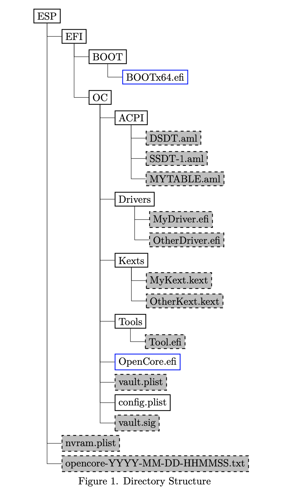

# Problemas con OpenCore

* Versión soportada: 0.6.2

* [Trancado en `no vault provided!`](#trancado-en-no-vault-provided)
* [Trancado en `OC: Invalid Vault mode`](#trancado-en-oc-invalid-vault-mode)
* [Trancado en `OCB: OcScanForBootEntries failure - Not Found`](#trancado-en-ocb-ocscanforbootentries-failure---not-found)
* [Trancado en `OCB: failed to match a default boot option`](#trancado-en-ocb-failed-to-match-a-default-boot-option)
* [Trancado en `OCS: No schema for DSDT, KernelAndKextPatch, RtVariable, SMBIOS, SystemParameters...`](#trancado-en-ocs-no-schema-for-dsdt-kernelandkextpatch-rtvariable-smbios-systemparameters)
* [Trancado en `OC: Driver XXX.efi at 0 cannot be found`](#trancado-en-oc-driver-xxxefi-at-0-cannot-be-found)
* [Recibiendo `Failed to parse real field of type 1`](#recibiendo-failed-to-parse-real-field-of-type-1)
* [No puedo seleccionar nada en el menú de OpenCore](#no-puedo-seleccionar-nada-en-el-menu-de-opencore)
* [SSDTs no siendo agregados](#ssdts-no-siendo-agregados)
* [Bootear opencore reinicia a la BIOS](#bootear-opencore-reinicia-a-la-bios)
* [OCABC: Incompatible OpenRuntime r4, require r10](#ocabc-incompatible-openruntime-r4-require-r10)

## Trancado en `no vault provided!`

Apaga el vaulting en tu config.plist debajo de `Misc -> Security -> Vault`, debes configurarlo a:

* `Optional`

Si ya has ejecutado el `sign.command`, deberás restaurar el archivo OpenCore.efi ya que se ha introducido la firma RSA-2048 de 256 bytes. Puedes obtener una nueva copia de OpenCore.efi aquí: [OpenCorePkg](https://github.com/acidanthera/OpenCorePkg/releases)

**Nota**: Vault y FileVault son 2 cosas distintas, consulta [Seguridad y FileVault](https://dortania.github.io/OpenCore-Post-Install/universal/security.html) para obtener más detalles.

## Trancado en `OC: Invalid Vault mode`

Es probable que sea un error ortográfico, las opciones en OpenCore distinguen entre mayúsculas y minúsculas, así que asegúrate de verificar detenidamente, **O**ptional es la forma correcta de ingresarlo en `Misc -> Security -> Vault`

## Trancado en `OCB: OcScanForBootEntries failure - Not Found`

Esto es debido a que OpenCore no puede encontrar ningún disco con tu ScanPolicy actual, configurándolo a `0` permite que se muestren todas las opciones de arranque

* `Misc -> Security -> ScanPolicy -> 0`

## Trancado en `OCB: failed to match a default boot option`

El mismo arreglo que `OCB: OcScanForBootEntries failure - Not Found`, OpenCore no puede encontrar ningún disco con el ScanPolicy actual, la configuración a`0` permitirá mostrar todas las opciones de arranque

* `Misc -> Security -> ScanPolicy -> 0`

## Trancado en `OCS: No schema for DSDT, KernelAndKextPatch, RtVariable, SMBIOS, SystemParameters...`

Esto es debido a que, o estás usando un config de Clover o estás usando un configurador como OpenCore y Clover configurator de Mackie. Necesitarás comenzar de nuevo y hacer un config nuevo o intentar darte cuenta toda la basura que tienes que eliminar de tu config. **Esto es por lo que no soportamos configuradores, son conocidos por estos errores**

## Trancado en `OC: Driver XXX.efi at 0 cannot be found`

Verifica que lo que tienes en EFI/OC/Drivers también está en tu config.plist -> UEFI -> Drivers. Esto debería ser resuelto corriendo la función snapshot de ProperTree de nuevo.

Ten en cuenta que las entradas distinguen entre mayúsculas y minúsculas

## Recibiendo "Failed to parse real field of type 1"

* Un valor que fue configurado a `real` cuando no debería serlo, esto generalmente es cuando Xcode convierte  `HaltLevel` por accidente:

```xml
<key>HaltLevel</key>
 <real>2147483648</real>
```

  Para arreglar esto, cambia `real` por `integer`:

```xml
<key>HaltLevel</key>
 <integer>2147483648</integer>
```
  
  Para arreglar esto, cambia `real` por `integer`:

## No puedo seleccionar nada en el menú de OpenCore

* Deshabilita `PollAppleHotKeys` y habilita `KeySupport`, luego elimina [OpenUsbKbDxe](https://github.com/acidanthera/OpenCorePkg/releases) de tu config.plist -> UEFI -> Drivers
  * Si lo anterior no funciona, haz lo contrario: deshabilita `KeySupport`, luego agrega [OpenUsbKbDxe](https://github.com/acidanthera/OpenCorePkg/releases) a tu config.plist -> UEFI -> Drivers

## SSDTs no siendo agregados

Con OpenCore, hay algunas comprobaciones de seguridad adicionales agregadas alrededor de los archivos ACPI, específicamente que el encabezado de la longitud de la tabla debe ser igual al tamaño del archivo. Esto es culpa de iASL cuando compiló el archivo. Ejemplo de cómo encontrarlo:

```
* Original Table Header:
*     Signature        "SSDT"
*     Length           0x0000015D (349)
*     Revision         0x02
*     Checksum         0xCF
*     OEM ID           "ACDT"
*     OEM Table ID     "SsdtEC"
*     OEM Revision     0x00001000 (4096)
*     Compiler ID      "INTL"
*     Compiler Version 0x20190509 (538510601)
```

El valor de `Length` y `checksum` es lo que nos importa, por lo que si nuestro SSDT es de 347 bytes, entonces queremos cambiar `Length` a `0x0000015B (347)`(el `015B` está en HEX)

La mejor manera de arreglar esto es tomar una copia más reciente de iASL o la copia de Acidanthera de [MaciASL](https://github.com/acidanthera/MaciASL/releases) y rehacer el SSDT

## Arrancando OpenCore reinicia a la BIOS

* Estructura de carpetas EFI incorrecta, asegúrate de que todos tus archivos OC estén dentro de una carpeta EFI ubicada en su ESP (partición del sistema EFI)

::: tip Ejemplo de estructura de la carpeta



:::

## OCABC: Incompatible OpenRuntime r4, require r10

OpenRuntime.efi desactualizado, asegúrate de que BOOTx64.efi, OpenCore.efi y OpenRuntime son **todos de la misma versión**. Cualquier cosa que no coincida interrumpirá el arranque

* **Nota**: FwRuntimeServices ha cambiado su nombre a OpenRuntime con 0.5.7 y más reciente
